# CWT Crypto Predictions Agent — System Flow Diagrams

> All diagrams use Mermaid syntax.
> **View options:**
> - GitHub: renders automatically in any `.md` file
> - VS Code: install "Markdown Preview Mermaid Support" extension → Ctrl+Shift+V
> - Online: paste into https://mermaid.live

---

## 1. System Architecture Overview

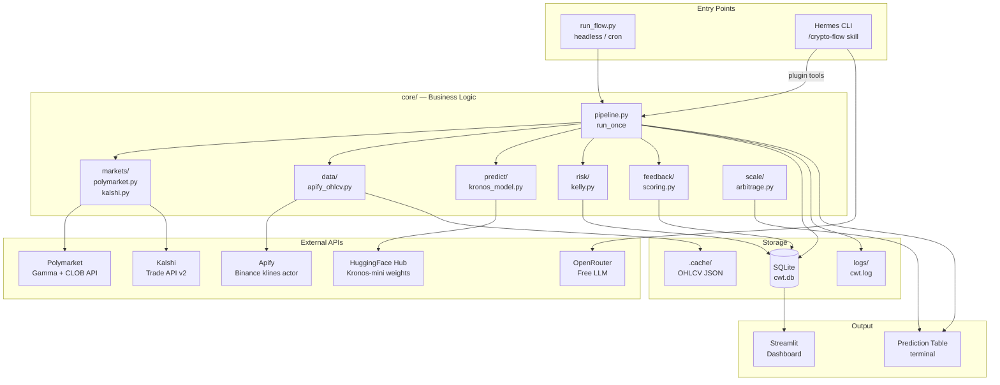

---

## 2. The 5-Agent Pipeline (One Cycle)

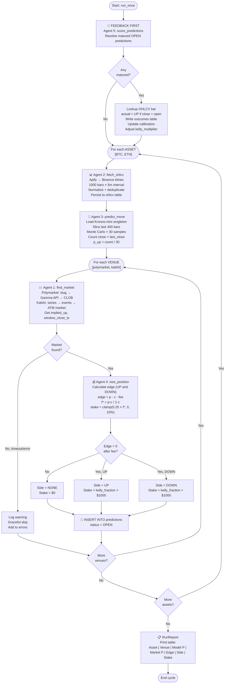

---

## 3. Polymarket Market Discovery (Sequence)

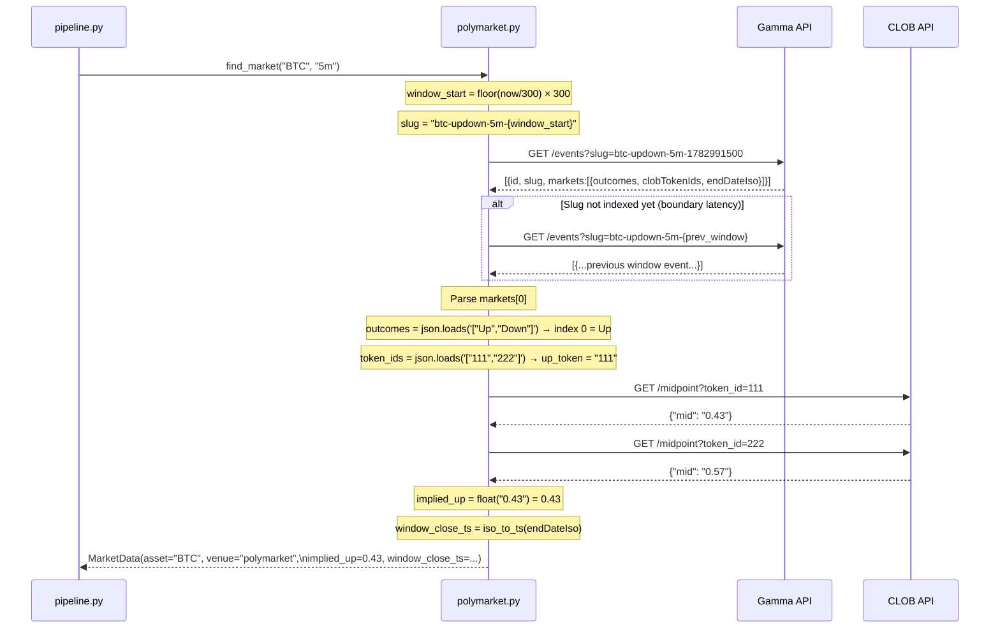

---

## 4. Kalshi Market Discovery (Sequence)

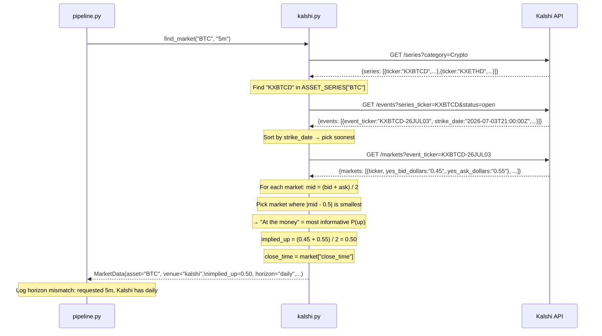

---

## 5. Database Entity-Relationship Diagram

```mermaid
erDiagram
    PREDICTIONS {
        int id PK
        int ts
        string asset
        string venue
        string horizon
        float model_p_up
        float market_p_up
        float edge
        string side
        float kelly_fraction
        float stake_paper
        int window_close_ts
        string status
        string created_at
    }

    OUTCOMES {
        int prediction_id PK_FK
        string resolved_at
        string actual_direction
        int won
        float pnl_paper
    }

    OHLCV {
        string asset PK
        string interval PK
        int open_time PK
        float open
        float high
        float low
        float close
        float volume
        float amount
        string source
    }

    MARKETS {
        int id PK
        int ts_window
        string asset
        string venue
        string horizon
        string up_ref
        string down_ref
        float implied_up
        float implied_down
        int window_close_ts
        string fetched_at
    }

    CALIBRATION {
        string asset PK
        int n
        float brier
        float hit_rate
        float kelly_multiplier
        string updated_at
    }

    RUNS {
        int id PK
        string started_at
        string finished_at
        int n_markets
        int n_predictions
        string notes
    }

    PREDICTIONS ||--o| OUTCOMES : "resolves to"
    PREDICTIONS }o--|| CALIBRATION : "scored per asset"
    PREDICTIONS }o--|| OHLCV : "resolved using"
```

---

## 6. Kelly Criterion Decision Tree

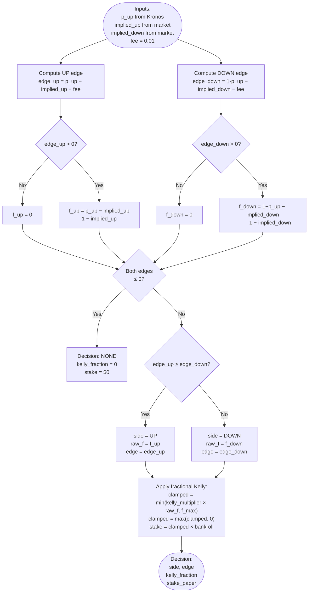

---

## 7. Feedback Loop & Calibration

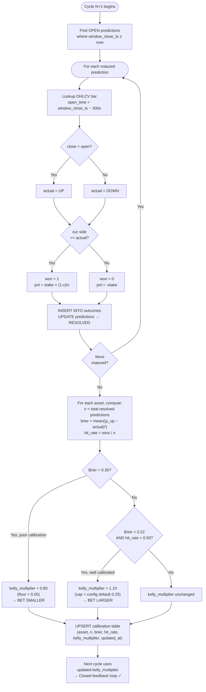

---

## 8. Two Entry Points Architecture

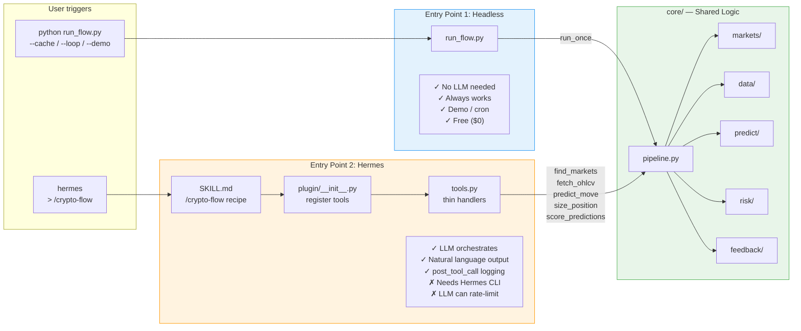

---

## 9. Apify OHLCV Fetch & Normalize

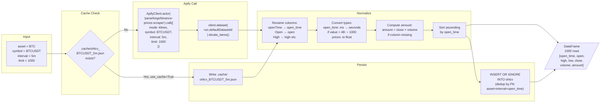

---

## 10. Kronos Monte Carlo P(up)

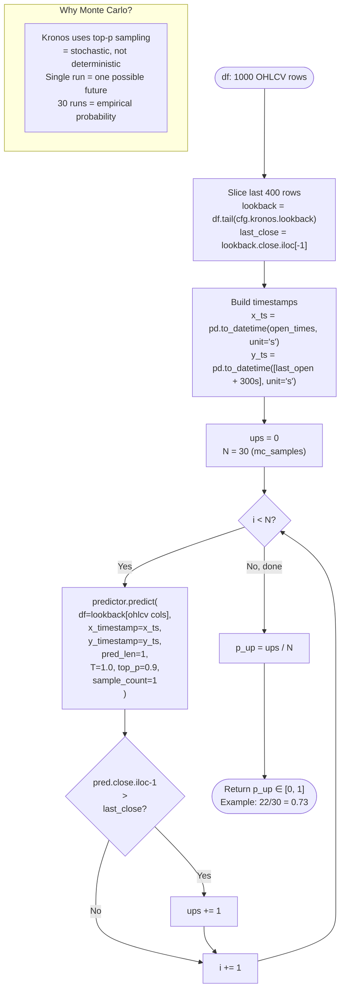

---

## 11. Cross-Venue Arbitrage Signal

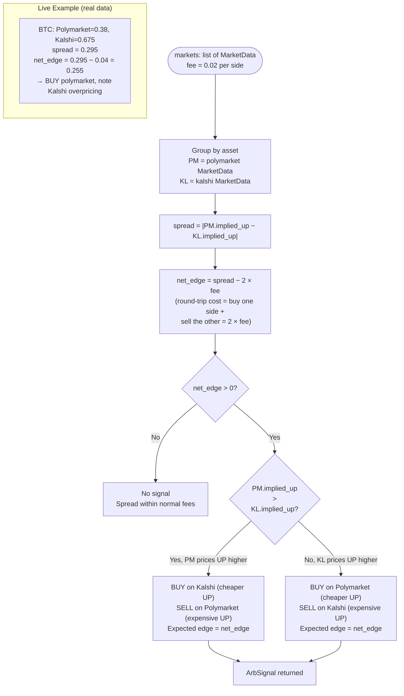

---

## 12. Testing Architecture

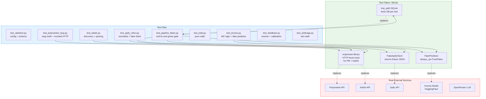
